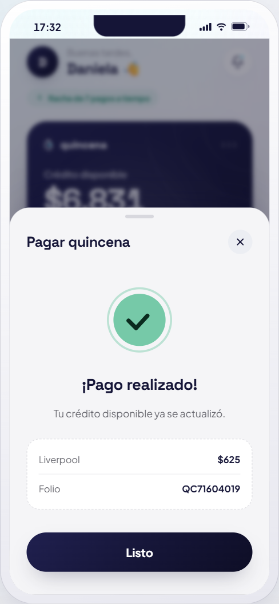
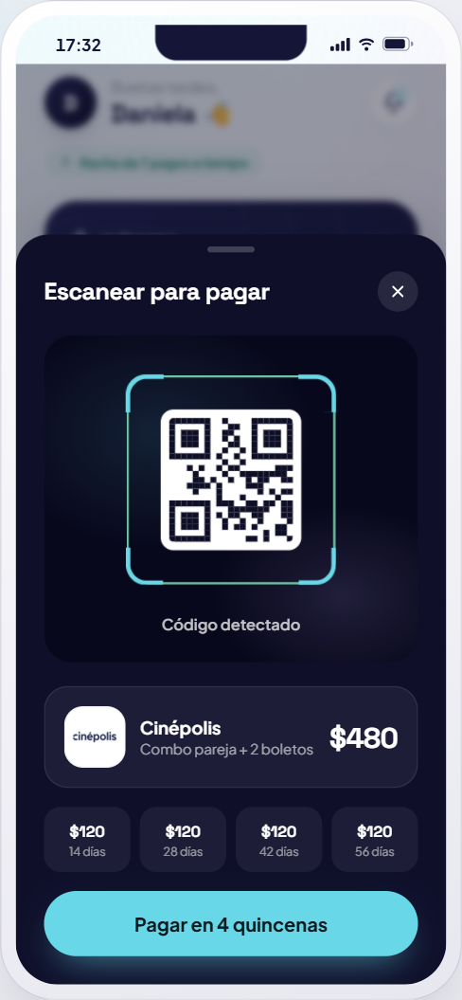
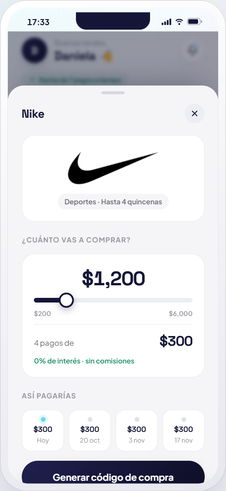
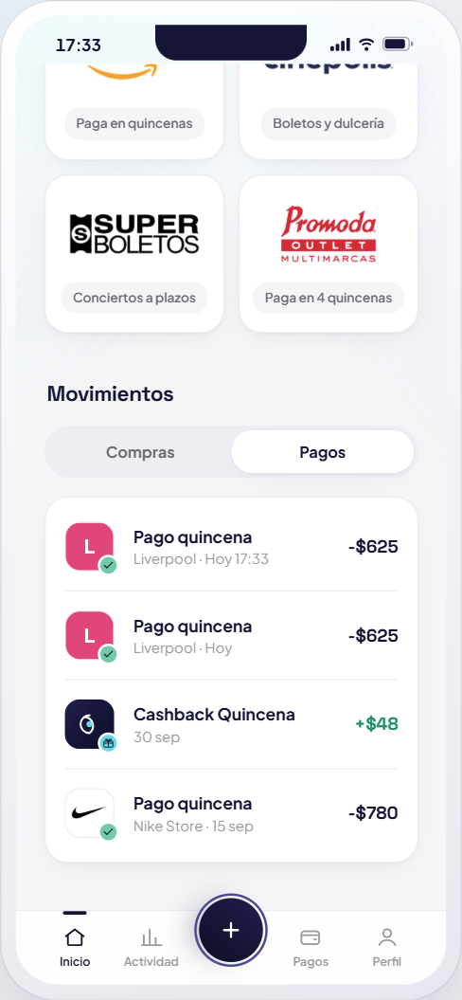
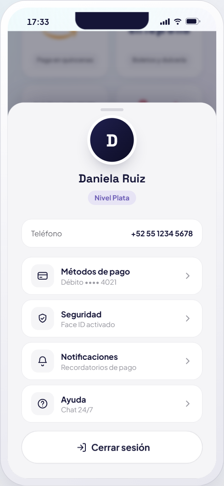

# Quincena — Demo UX/UI

Prototipo de interfaz (solo diseño) de una app ficticia de **BNPL** ("compra hoy, paga en 4 quincenas"), construido con **React + Vite** y **Framer Motion**.

> ⚠️ **Marca y datos 100% ficticios.** "Quincena" es una marca inventada; no representa ni se conecta con ninguna empresa real. Los datos son de muestra y la verificación es **simulada**: no se envía ningún SMS real ni se guarda el número; el código aparece como notificación dentro del teléfono. Los logos de comercios pertenecen a sus respectivos dueños y se usan solo como referencia visual. Es una pieza de portafolio de UI/UX.

## Capturas

<table>
  <tr>
    <td align="center"><br/><sub><b>Bienvenida</b></sub></td>
    <td align="center"><br/><sub><b>Teléfono</b></sub></td>
    <td align="center"><br/><sub><b>Verificación por SMS</b></sub></td>
  </tr>
  <tr>
    <td align="center"><br/><sub><b>Dashboard</b></sub></td>
    <td align="center"><br/><sub><b>Pago realizado</b></sub></td>
    <td align="center"><br/><sub><b>Escanear y pagar</b></sub></td>
  </tr>
  <tr>
    <td align="center"><br/><sub><b>Simulador de tienda</b></sub></td>
    <td align="center"><br/><sub><b>Movimientos</b></sub></td>
    <td align="center"><br/><sub><b>Perfil</b></sub></td>
  </tr>
</table>

## Pantallas

1. **Bienvenida** — hero animado, beneficios, tira infinita de logos de tiendas y prueba social.
2. **Teléfono** — número con formato en vivo (máximo 10 dígitos, también al pegar), validación y aviso de dígitos faltantes.
3. **Verificación** — llega un SMS simulado con un código aleatorio; tocarlo rellena las casillas. Se valida el código, se puede pegar y el contador de reenvío corre de verdad.
4. **Dashboard** — todo funciona con estado real:
   - **Pagar** una quincena sube tu crédito, avanza la compra, suma a tu racha y agrega el movimiento.
   - **Escanear** (botón +) detecta un QR y aprueba una compra nueva en 4 quincenas.
   - **Tiendas**: simulador de pagos con slider y código de compra con vencimiento.
   - **Tus compras**: calendario de los 4 pagos y opción de adelantar.
   - **Límite**, **notificaciones** y **perfil** (con cerrar sesión).

## Diseño

- Tema claro: navy `#151537` (primario) + cian `#68D7E8` (acento) sobre fondo gris claro con tarjetas blancas.
- Logos reales de comercios en [`src/assets/logos/`](src/assets/logos/) (PNG transparentes, `object-fit: contain`).
- Responsive: marco de teléfono en escritorio/tablet; pantalla completa en móvil.
- Tarjetas limpias, luz ambiental sutil y acentos en morado/verde.
- Tipografías *Space Grotesk* (display) + *Plus Jakarta Sans*.
- Animaciones con **GSAP** (entradas coreografiadas, revelado al hacer scroll con ScrollTrigger, montos que cuentan, tilt 3D de la tarjeta, palomita que se dibuja) y Framer Motion para transiciones y hojas deslizables.
- Patrones de fintech 2026: onboarding por pasos, dashboard accionable, gradientes suaves y tipografía fuerte.

## ✏️ ¿Cómo lo edito?

¿Quieres cambiar textos, colores o diseño sin perderte? Lee **[GUIA.md](GUIA.md)**.
En resumen:
- **Textos y datos** (nombres, montos, comercios): [`src/content.js`](src/content.js) — un solo archivo.
- **Colores y tipografía**: bloque `:root` en [`src/styles.css`](src/styles.css).
- **Diseño de cada parte**: secciones comentadas en el mismo `styles.css`.

## Correr en local

```bash
npm install
npm run dev
```

Abre http://localhost:5173

## Build

```bash
npm run build
npm run preview
```

## Stack

- React 18
- Vite 5
- Framer Motion 11
- GSAP 3 (+ @gsap/react, ScrollTrigger)
