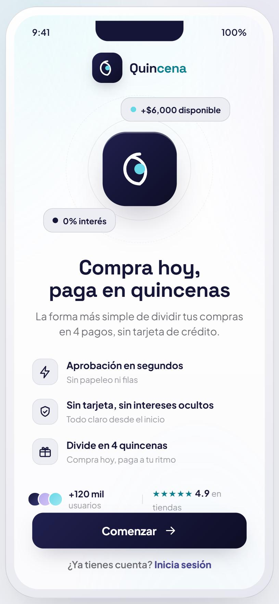
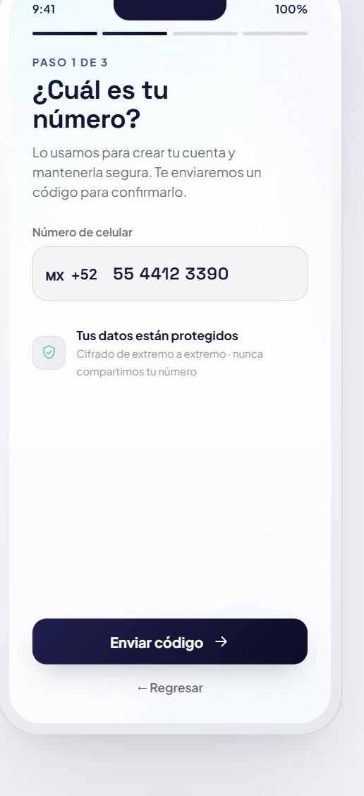
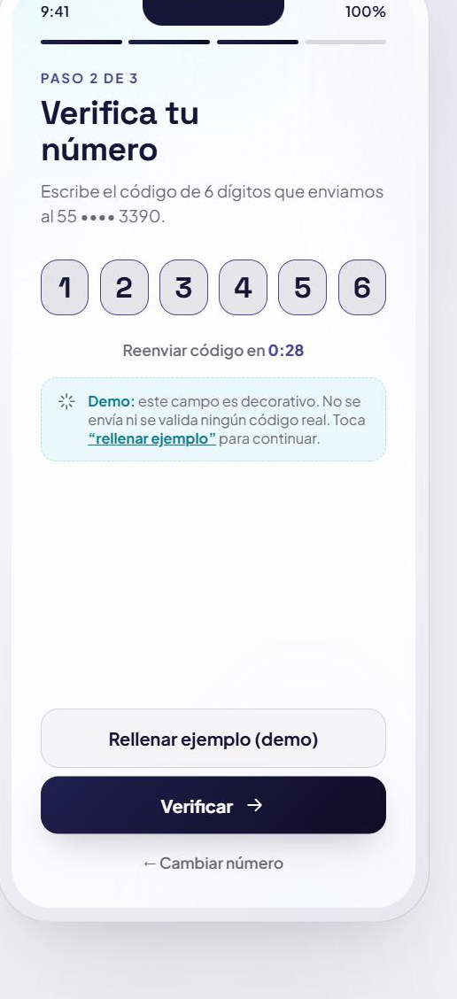
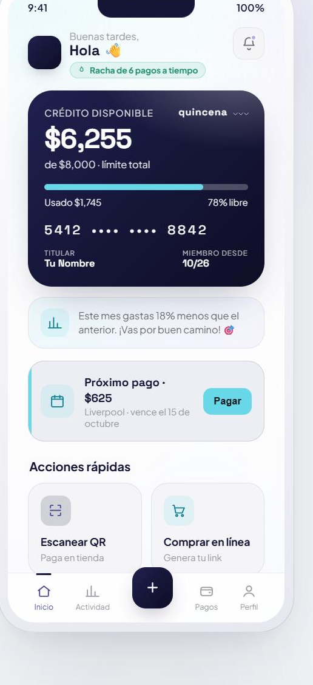
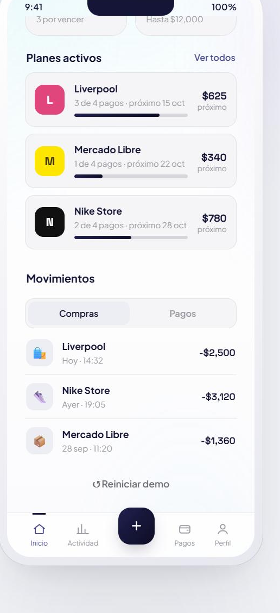

# Quincena — Demo UX/UI

Prototipo de interfaz (solo diseño) de una app ficticia de **BNPL** ("compra hoy, paga en 4 quincenas"), construido con **React + Vite** y **Framer Motion**.

> ⚠️ **Marca y datos 100% ficticios.** "Quincena" es una marca inventada; no representa ni se conecta con ninguna empresa real. Los datos son de muestra y los campos de verificación son **decorativos** (no envían ni validan ningún código). Es una pieza de portafolio de UI/UX.

## Capturas

<table>
  <tr>
    <td align="center"><br/><sub><b>Bienvenida</b></sub></td>
    <td align="center"><br/><sub><b>Teléfono</b></sub></td>
    <td align="center"><br/><sub><b>Verificación (OTP)</b></sub></td>
  </tr>
  <tr>
    <td align="center"><br/><sub><b>Dashboard</b></sub></td>
    <td align="center"><br/><sub><b>Planes y movimientos</b></sub></td>
    <td></td>
  </tr>
</table>

## Pantallas

1. **Bienvenida** — hero animado, beneficios y prueba social.
2. **Teléfono** — captura con formato en vivo, validación y onboarding tipo wizard.
3. **Verificación (OTP)** — 6 dígitos con auto-avance + transición "Verificando → ✓" (decorativa).
4. **Dashboard** — tarjeta de crédito, insight de gasto, próximo pago, planes activos y movimientos con control segmentado.

## Diseño

- Tema claro: navy `#151537` (primario) + cian `#68D7E8` (acento) sobre fondo blanco.
- Tarjetas limpias, luz ambiental sutil y acentos en morado/verde.
- Tipografías *Space Grotesk* (display) + *Plus Jakarta Sans*.
- Micro-interacciones con Framer Motion.
- Patrones de fintech 2026: onboarding por pasos, dashboard accionable, gradientes suaves y tipografía fuerte.

## ✏️ ¿Cómo lo edito?

¿Quieres cambiar textos, colores o diseño sin perderte? Lee **[GUIA.md](GUIA.md)**.
En resumen:
- **Textos y datos** (nombres, montos, comercios): [`src/content.js`](src/content.js) — un solo archivo.
- **Colores y tipografía**: bloque `:root` en [`src/styles.css`](src/styles.css).
- **Diseño de cada parte**: secciones comentadas en el mismo `styles.css`.

## Correr en local

```bash
npm install
npm run dev
```

Abre http://localhost:5173

## Build

```bash
npm run build
npm run preview
```

## Stack

- React 18
- Vite 5
- Framer Motion 11
